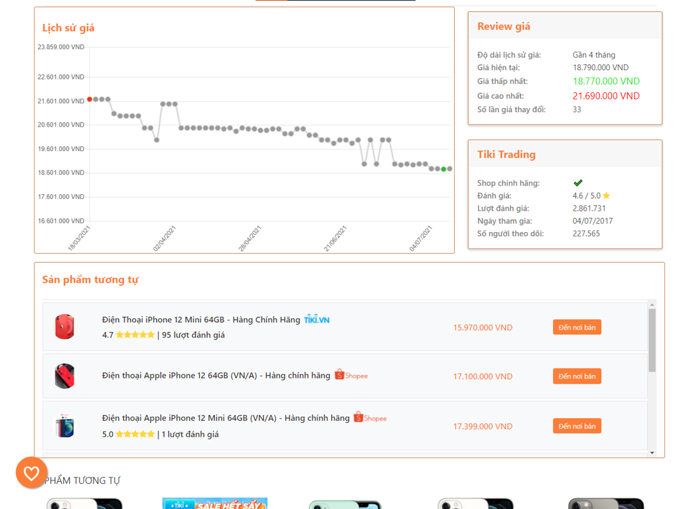
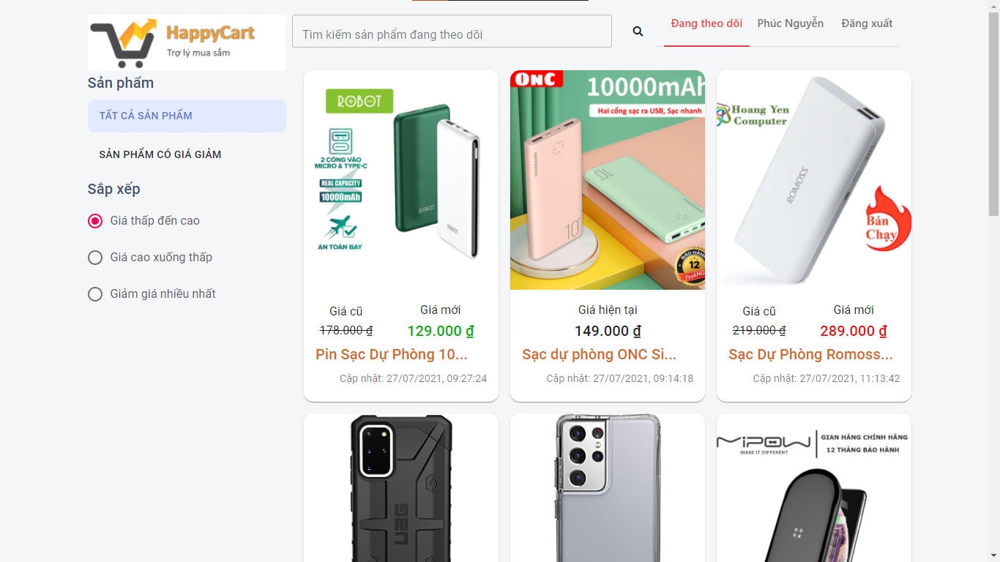
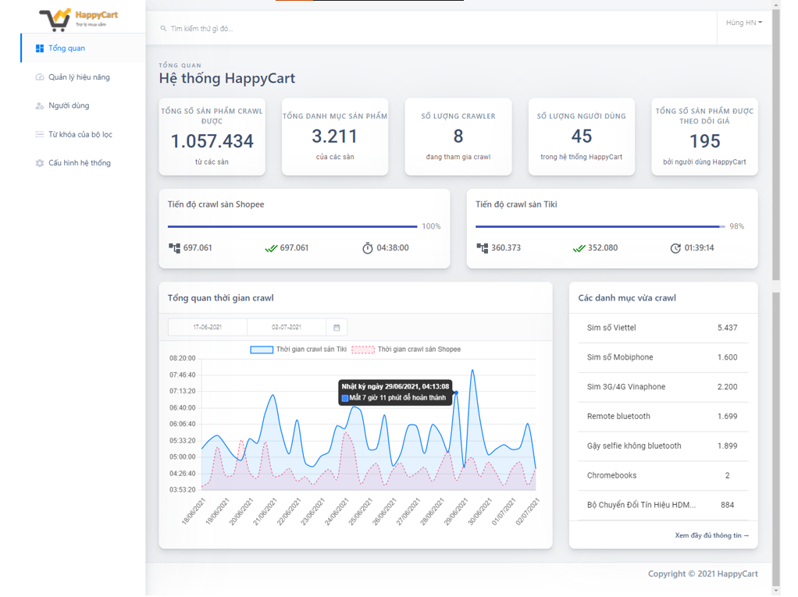
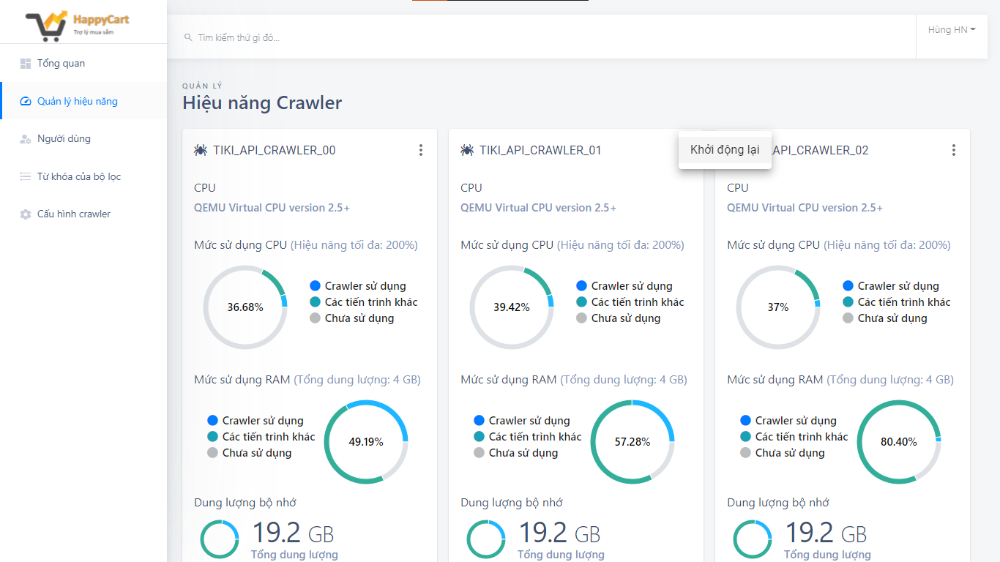
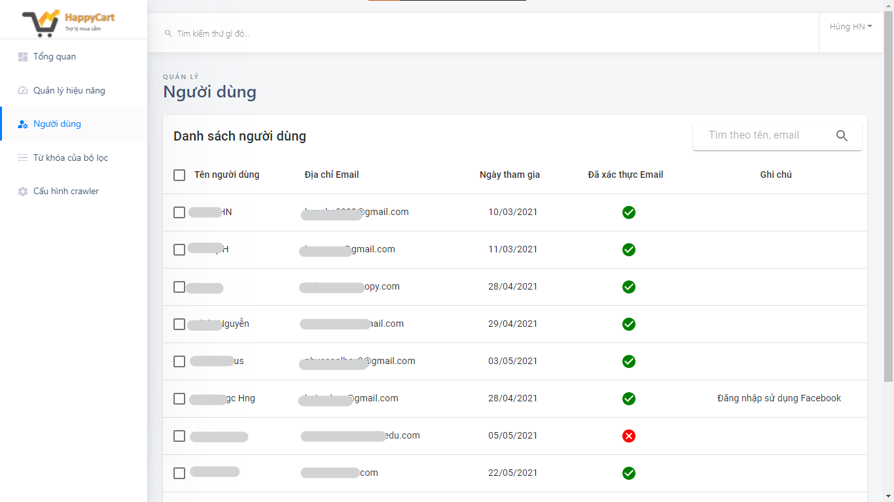
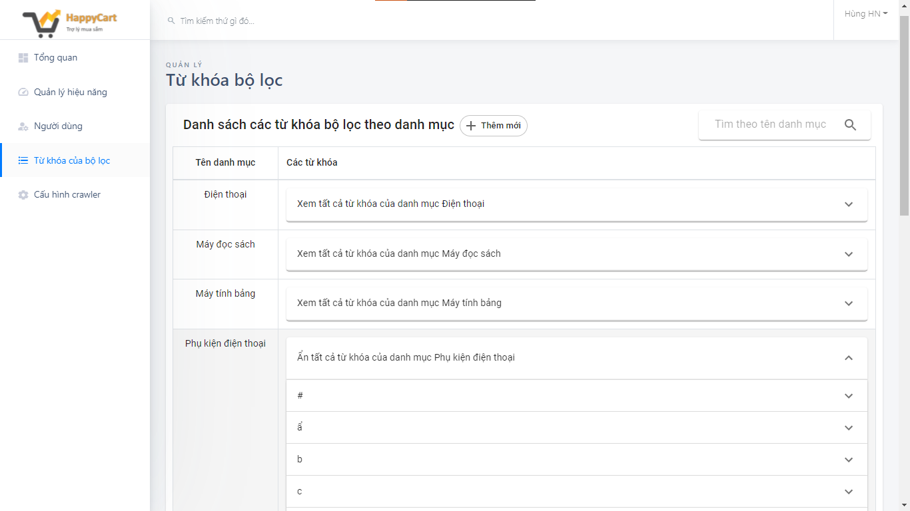
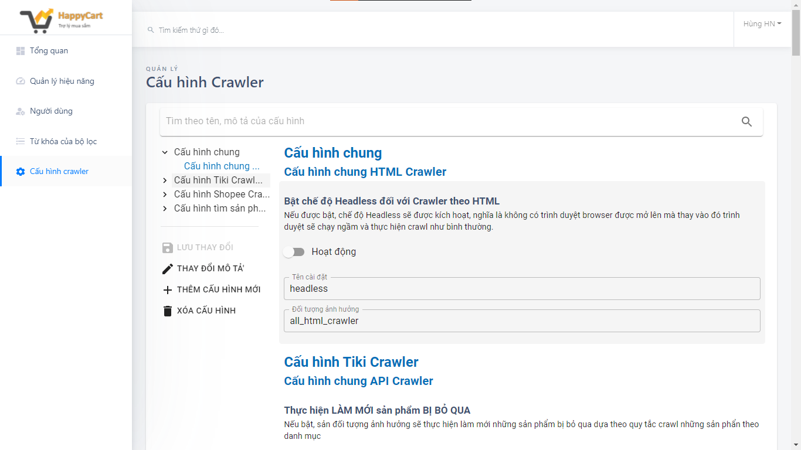
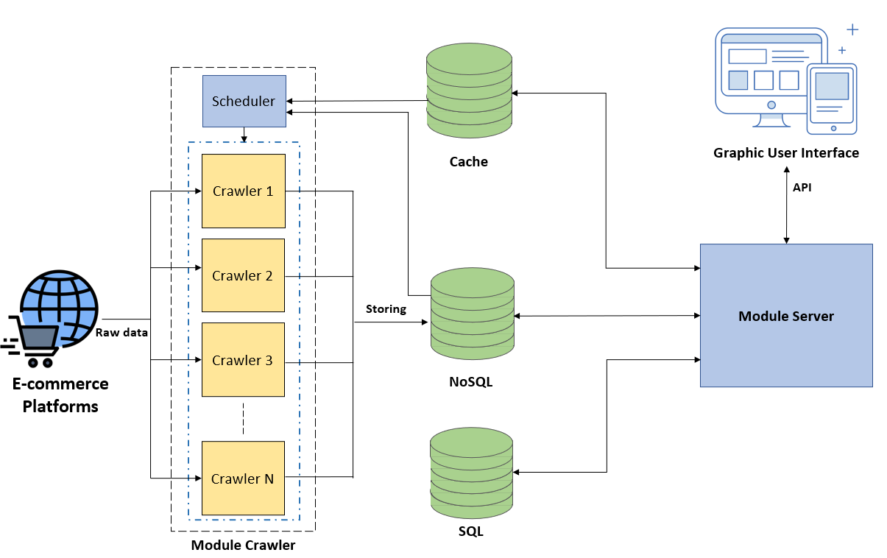

<!-- # Web service distributing crawled data from crawlers. -->
<!-- :white_check_mark: -->

# Table of contents
- [Demo Pictures](#demo-pictures)
- [Backend API Specifications](#backend-api-specifications)
    - [Item & User Services](#item--user-services)
    - [Admin & Management](#admin--management)
    - [Security](#security)
- [Technologies Stack](#technologies-stack)
- [Overview Architecture](#overview-architecture)

# Demo Pictures

*This is the representative repository so that these demo pictures below are nearly every features of the application*

  
Show demo pictures

- Extension:

 

- User's tracked items management web view:

 

- Admin dashboard:

 

- Admin crawler management:

 

- Admin user management:

 

- Admin stop words management:

 

- Admin configs management:

# Backend API Specifications

### Item & User Services
<!-- - Data for chart showing price of item at the different time. -->
  :heavy_check_mark: Available with **Tiki and Shopee platform** by now.

- Show relative information about item by receiving: *item ID, seller ID and item URL*.

  :white_check_mark: Price changing history (detail to hours in a day)

  :white_check_mark: Preview images

  :white_check_mark: Information about the seller selling that item

- Users are able to track items and get notifications if there is decreasing in item's price that meets user expectation.

  :white_check_mark: Choose an item to tracking it's price

  :white_check_mark: Managing tracked items

  :white_check_mark: Send to users notifications if prices are changes via `Firebase` and Google Email 

- Others:

  :white_large_square: ~~Show relevant products~~ (completed, hosting in another server)

### Users & Authentication
- Authentication will be on using JWT/cookies
  
  :white_check_mark: JWT and cookie should expired in 1 hour
  
  :white_check_mark: Refresh token won't be expired until 90 days 

  :white_check_mark: Access token is renewable by using refresh token
- User registration

  :white_check_mark: Register as a `user`

  :white_check_mark: Once registered, a token will be sent via email to verify email

  :white_check_mark: Passwords must be hashed
- User login

  :white_check_mark: User can login with email and password or authenticated by Facebook

  :white_check_mark: Plain text password will compare with stored hashed password

  :white_check_mark: Once logged in, a token will be sent along with a cookie (token = xxx)
- User logout

  :white_check_mark: Cookie will be sent to set token = none
- Get user

  :white_check_mark: Route to get the currently logged in user (via token)
- Password reset (forget password)

  :white_check_mark: User can request to reset password

  :white_check_mark: A hashed token will be emailed to the users registered email address

  :white_check_mark: A put request can be made to the generated url to reset password

  :white_check_mark: The token will expire after 10 minutes
- Update user info

  :white_check_mark: Authenticated user only

  :white_check_mark: Separate route to update password

### Admin & Management
- Users

  :white_check_mark: Users C.R.U.D

  :white_check_mark: Users can only grant `admin` role by updating the database field manually or by updating by an admin

- Crawlers

  :white_check_mark: Crawler vCPU, RAM, network consumption, disk space information

  :white_check_mark: Restart a specific crawler

  :white_check_mark: Crawling progress information

  :white_check_mark: Crawling time overview (via logs)

  :white_check_mark: Update crawlers configs (Time between crawling, class name to extract data,...) 

  :white_check_mark: Update stop-words for filtering of `relevant products` service

### Security
- Encrypt passwords and reset tokens
- Prevent NoSQL injections
- Add headers for security (helmet)
- Prevent cross site scripting - XSS
- Protect against HTTP Params Pollution
- Use cors to make API public (for now)

# Technologies Stack
- *Crawler*: NodeJS, ExpressJS, Axios, CronJob, Python, Selenium, FastAPI
- *Backend*: NodeJS, ExpressJS, Java Spring
- *Frontend*: ReactJS, Chrome Extension (Web platform), Java Android (Mobile platform)
- *Database*: MongoDB, MySQL, Redis
- *Notification*: Firebase

# Overview Architecture
(This web service is a part of `module server`)

***
*This web service is a part of my thesis.*

**Author: Hoàng Ngọc Hùng - VNU HCMC - UIT**
